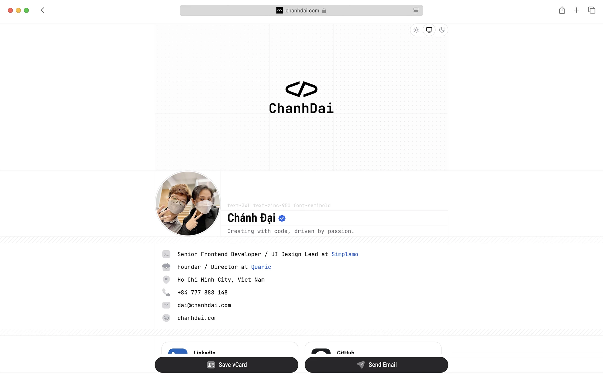

# chanhdai.com

chanhdai.com is my portfolio website, showcasing my work and experience as a Software Developer & UI/UX Designer. It is built with [Next.js](https://nextjs.org), [Tailwind CSS](https://tailwindcss.com), and [shadcn/ui](https://ui.shadcn.com) to deliver a modern, fast, and seamless user experience.

This is a continuously evolving side project where I experiment with new technologies and keep it updated with the latest advancements in web development.

Check out the live site: [chanhdai.com](https://chanhdai.com)

<picture>
  <source media="(prefers-color-scheme: dark)" srcset="./.github/preview-dark.webp">
  
</picture>

## Core Features & Technologies

- **Beautiful and simple design**: Elegant, minimalistic UI for a clean and modern look
- **Dark Mode**: Supports light and dark themes for a better user experience
- [vCard](https://en.wikipedia.org/wiki/VCard): Digital business card with contact details
- [JSON-LD schema](https://json-ld.org): Structured data for better SEO and rich snippets
- **Email address obfuscation**: Protects email from spam bots
- [Next.js 15](https://nextjs.org/): Latest React framework for optimized performance and scalability
- [Tailwind CSS v4](https://tailwindcss.com): Modern utility-first CSS framework for styling

## Compatibility

### Browser support

Tailwind CSS v4.0 is designed for and tested on modern browsers, and the core functionality of the framework specifically depends on these browser versions:

- **Chrome 111** (released March 2023)
- **Safari 16.4** (released March 2023)
- **Firefox 128** (released July 2024)

> Reference: [https://tailwindcss.com/docs/compatibility#browser-support](https://tailwindcss.com/docs/compatibility#browser-support)

## Development

Please refer to the [Development Guide](./DEVELOPMENT.md) for more details.

## License

Licensed under the [MIT license](./LICENSE).

> You're free to use my code! Just make sure to remove all my personal information before publishing your website. It's awesome to see my code being useful to someone!

## Acknowledgments

- [React](https://react.dev)
- [Next.js](https://nextjs.org)
- [Tailwind CSS](https://tailwindcss.com)
- [Radix UI](https://www.radix-ui.com)
- [Motion](https://motion.dev)
- [shadcn/ui](https://ui.shadcn.com)
- [Aceternity UI](https://ui.aceternity.com)
- And many other open-source libraries used in `package.json`